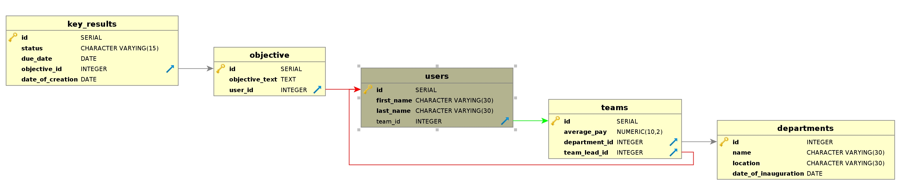

## Requirements

1. This project uses PostgresSql 12.2 as its db. Please follow the steps in the [link](https://github.com/user/repo/blob/branch/other_file.md) for installing postgres. 

2. Once PostgresSql is installed, run the following commands:
  * Enter psql console by 
```
sudo -u postgres psql
```
  * Execute the following commands in the psql console:
```
CREATE DATABASE betterworks_analytics;
CREATE USER betterworks_admin WITH ENCRYPTED PASSWORD 'password_123';
GRANT ALL PRIVILEGES ON DATABASE betterworks_analytics TO betterworks_admin;
```
4. Please make sure you have Python 3.8, pip and and virtualenv installed.

5. Clone this repo to your system and navigate to the repo directory and run the following commands:
```
virtualenv env
source env/bin/activate
pip install -r requirements.txt
``` 


## Running the application

1. Please make sure you have psql running on port 5432.
2. Please enter the following to run the application.
```
python manage.py migrate
python manage.py runserver
```

## Database Design



## Features implemented

1. Api for getting basic objective metrics for the company across all deprtments.

2. Api for getting department-wise metrics of objectives.

3. Api for getting metrics of objectives among different teams within a department.

4. Basic CRUD api's and integration with Django admin for all DB tables.

## To be implemented

1. Testcases for the three api's

## API signatures
   * The sample objects for each table can be created via the django admin ui at localhost:8000/admin or the crud api's
    
1. Get api for basic objective metrics for the company across all deprtments:
  * URL `http://localhost:8000/objectives/summary/` with response as follows
  ```
  {
    "total_count": 4,
    "not_on_track_count": 2,
    "on_track_count": 2,
    "on_track_percentage": "50.00%",
    "not_on_track_percentage": "50.00%"
  }
  ```
  
  
2. Get api for department-wise metrics of objectives:
  * URL `http://localhost:8000/objectives/department_wise_summary/` with response as follows
```
{
  "summary_list":
    [
      {
        "department_name": "Product",
        "total_count": 3,
        "not_on_track_count": 2,
        "users_count": 3,
        "department_id": 8,
        "on_track_count": 1,
        "on_track_percentage": "33.33%",
        "not_on_track_percentage": "66.66%"
       },
       {
        "department_name": "Marketing",
        "total_count": 1,
        "not_on_track_count": 0,
        "users_count": 1,
        "department_id": 1,
        "on_track_count": 1,
        "on_track_percentage": "100.00%",
        "not_on_track_percentage": "0.00%"
       }
    ]
}

```

3. Get api for team-wise metrics of objectives within a department:
  * URL `http://localhost:8000/objectives/team_wise_summary?department_id=<department_id>` with response as follows:
```  
{
  "summary_list":
  [
    {
      "team_id": 1,
      "total_count": 2,
      "not_on_track_count": 1,
      "team_lead_name": "Mark",
      "on_track_count": 1,
      "on_track_percentage": "50.00%",
      "not_on_track_percentage": "50.00%"
    },
    {
      "team_id": 3,
      "total_count": 1,
      "not_on_track_count": 1,
      "team_lead_name": "Antony",
      "on_track_count": 0,
      "on_track_percentage": "0.00%",
      "not_on_track_percentage": "100.00%"
    }
  ]
}
```


